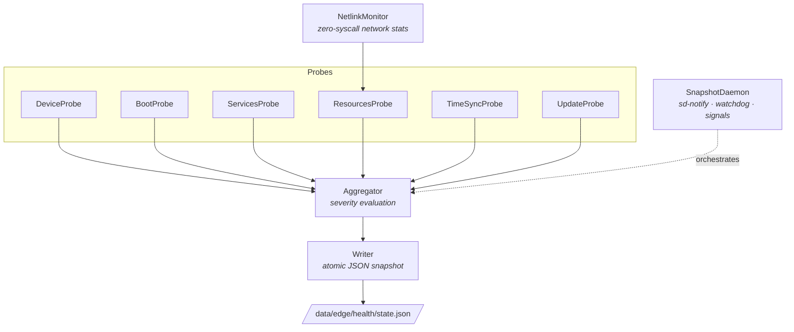

# edge-healthd

[](https://github.com/umair-uas/edge-healthd/actions/workflows/ci.yml)
[](https://en.cppreference.com/w/cpp/23)
[](https://opensource.org/licenses/MIT)
[]()

A lightweight health monitoring daemon for resource-constrained edge gateways. It continuously collects device metrics via modular probes and writes atomic JSON snapshots to disk — designed for offline-first operation and fleet management integration.

## Supported Platforms

| Platform | Architecture |
|----------|-------------|
| VisionFive2 | riscv64 |
| Raspberry Pi 5 | aarch64 |
| i.MX93 EVK | aarch64 |

## Features

- **Boot health** — uptime, boot failures, consecutive failure tracking
- **Systemd services** — unit states, restart loops, failure detection via D-Bus
- **System resources** — CPU load, memory, disk, temperature, network (via Netlink)
- **Time synchronization** — NTP lock status and offset
- **Software updates** — version tracking, A/B slot status, update results
- **Atomic writes** — snapshot file is always consistent (temp + fsync + rename)
- **Systemd integration** — sd-notify, watchdog, journal-aware logging

## Architecture

Six probes collect data from the kernel, D-Bus, and filesystem. The aggregator evaluates severity thresholds (ok / warn / crit) per subsystem and the writer atomically commits a JSON snapshot.



## Snapshot Output

The daemon writes a structured JSON snapshot to `/data/edge/health/state.json`:

```json
{
  "schema": "edge.health.state",
  "schema_version": "1.0",
  "generated_at": "2026-01-26T10:15:30Z",
  "device": { "device_id": "vf2-001", "platform": "visionfive2", "arch": "riscv64" },
  "boot": { "boot_ok": true, "uptime": 86400, "boot_fail_count": 0 },
  "services": { "overall": "ok", "units": [ "..." ] },
  "resources": { "cpu": { "load1": 0.12 }, "memory": { "used_mb": 312 }, "..." : "..." },
  "time_sync": { "overall": "ok", "source": "ntp" },
  "update": { "overall": "ok", "active_slot": "A" },
  "summary": { "severity": "ok", "reasons": [] }
}
```

## Quick Start

### Requirements

- C++23 compiler (GCC 13+ or Clang 17+)
- CMake 3.20+, Ninja
- libsystemd-dev, libmnl-dev, pkg-config
- sdbus-c++ v2.0 (auto-fetched with `-DEDGE_FETCH_SDBUSCPP=ON`)

### Build

```bash
cmake -B build -G Ninja -DCMAKE_BUILD_TYPE=Release -DEDGE_FETCH_SDBUSCPP=ON
cmake --build build
```

### Build Options

| Option | Default | Description |
|--------|---------|-------------|
| `EDGE_BUILD_TESTS` | OFF | Build Catch2 unit tests |
| `EDGE_ENABLE_SANITIZERS` | OFF | Enable ASan/UBSan (Debug builds) |
| `EDGE_ENABLE_LTO` | ON | Link-time optimization (Release builds) |
| `EDGE_FETCH_SDBUSCPP` | OFF | Auto-fetch sdbus-c++ v2.0 via FetchContent |
| `EDGE_WEB_UI` | OFF | Build optional web dashboard |

## Usage

```bash
edge-healthd                           # Run as daemon
edge-healthd -f -v                     # Foreground with verbose logging
edge-healthd --once                    # Single snapshot, then exit
edge-healthd -c /path/to/config.json   # Custom config file
edge-healthd --dump-config             # Print effective config and exit
```

## Configuration

Default config path: `/etc/edge/healthd.conf`

```json
{
  "device_id": "edge-001",
  "platform": "visionfive2",
  "snapshot_file": "/data/edge/health/state.json",
  "collect_interval_sec": 60,
  "monitored_services": ["sshd.service", "NetworkManager.service"],
  "monitored_mounts": ["/", "/data"],
  "thresholds": {
    "cpu_load_warn": 80,
    "mem_used_crit": 95
  }
}
```

See [`config/healthd.conf.example`](config/healthd.conf.example) for all options.

## Deployment

```bash
sudo cmake --install build
sudo systemctl enable --now edge-healthd
```

## License

MIT
