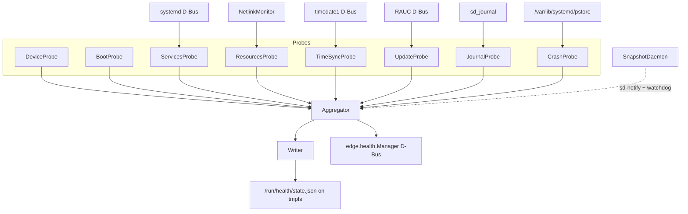

# edge-healthd 🩺

[](https://github.com/umair-as/edge-healthd/actions/workflows/ci.yml)
[](https://en.cppreference.com/w/cpp/23)
[](https://opensource.org/licenses/MIT)
[]()

A lightweight, offline-first health monitoring daemon for resource-constrained edge gateways. Modular probes feed an aggregator that writes an atomic JSON snapshot to tmpfs each cycle — designed for fleet observability on devices that are intermittently connected, read-only-rootfs, and flash-wear sensitive.

## Why edge-healthd?

- **Tiny footprint** — ~12 ms / 0.97 ms kernel time per cycle; ~0.02 % duty cycle on a Raspberry Pi 5. Capped at 64 MB RAM / 10 % CPU via systemd.
- **No agent server required** — writes a single JSON file. Read it locally, scrape it, or expose it via the optional web UI.
- **Flash-friendly** — snapshot lives in tmpfs; persistent state is one tiny file under `/data`.
- **Hardened** — `ProtectSystem=strict`, `NoNewPrivileges`, syscall filter, dropped to a single capability (`CAP_NET_RAW`).
- **Built for offline** — gracefully degrades when D-Bus services (RAUC, timedated) are absent.

## Supported platforms

| Platform | Architecture | Status |
|----------|-------------|--------|
| Raspberry Pi 5 | aarch64 | ✅ Production (Yocto `igw.0.1`) |
| VisionFive2 | riscv64 | 🔨 build-tested |
| i.MX93 EVK | aarch64 | 🔨 build-tested |

Targets any Linux ≥ 5.10 with systemd ≥ 250. The probe layer degrades cleanly on systems missing optional services (RAUC, timedated, journald).

## Features

Eight probes feeding a single aggregator:

- **Boot health** — uptime, consecutive boot-failure tracking
- **Systemd services** — unit states, restart counts, socket-activated detection
- **System resources** — CPU, memory, disks, thermal, network via event-driven Netlink (zero-poll)
- **Time synchronization** — NTP lock via `timedate1`; RTC battery voltage + drift via sysfs
- **OTA updates** — RAUC A/B slot status; immediate refresh on `Installer.Completed`
- **Journal scan** — system-wide error/critical log digest with bounded scan budget
- **Crash artifacts** — kernel-panic detection via `systemd-pstore`, alarm-once semantics
- **Device identity** — stable hardware ID from `/proc/device-tree/serial-number`

Plus atomic snapshot writes, a `edge.health.Manager` D-Bus interface, and an opt-in Preact + Go web dashboard.

## Architecture



Each probe returns `std::expected<DataType, ProbeError>`. The `SnapshotAggregator` runs them on independent schedules, evaluates per-subsystem severity thresholds, and emits a `SnapshotState`. The writer commits it atomically.

## Quick start

```bash
# Build (Release)
cmake -B build -G Ninja -DCMAKE_BUILD_TYPE=Release -DEDGE_FETCH_SDBUSCPP=ON
cmake --build build

# Install + enable
sudo cmake --install build
sudo systemctl enable --now edge-healthd

# Read the snapshot
cat /run/health/state.json | jq .summary
```

Full documentation lives in [`docs/`](docs/). The optional web UI is covered in [`web/README.md`](web/README.md).

## Contributing

Issues and pull requests are welcome.

- **Conventional Commits**: `type(scope): description` — types: `feat`, `fix`, `refactor`, `build`, `docs`, `test`, `chore`, `perf`
- One commit per feature/fix; PRs are squash-merged onto `main`
- `ctest --test-dir build --output-on-failure` must pass; ASan + UBSan clean is a hard CI requirement
- For larger changes, open an issue first to discuss scope

## License

[MIT](LICENSE) — Copyright (c) 2026 Umair A.S.
