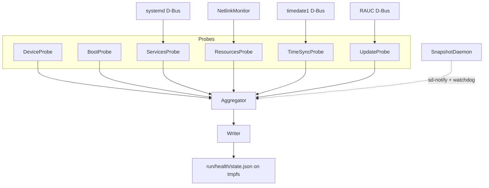

# edge-healthd 🩺

[](https://github.com/umair-as/edge-healthd/actions/workflows/ci.yml)
[](https://en.cppreference.com/w/cpp/23)
[](https://opensource.org/licenses/MIT)
[]()

A lightweight health monitoring daemon for resource-constrained edge gateways. It collects device metrics via modular probes and writes an atomic JSON snapshot to tmpfs every collection cycle — designed for offline-first operation and fleet observability.

## 🖥️ Supported Platforms

| Platform | Architecture | Status |
|----------|-------------|--------|
| Raspberry Pi 5 | aarch64 | ✅ Yocto `igw.0.1` |
| VisionFive2 | riscv64 | 🔨 build-tested |
| i.MX93 EVK | aarch64 | 🔨 build-tested |

## ✨ Features

- 🔁 **Boot health** — uptime, consecutive boot failure tracking via persistent state
- ⚙️ **Systemd services** — unit states, restart counts, socket-activated service detection (e.g. `sshd.socket`)
- 📊 **System resources** — CPU load, memory, disk mounts, temperature, network stats via event-driven Netlink (zero-poll)
- 🌐 **Network auto-discovery** — reports all non-loopback interfaces when `monitored_interfaces` is not configured
- 🕐 **Time synchronization** — NTP lock state via `org.freedesktop.timedate1` (systemd-timedated); RTC battery voltage and clock drift via sysfs (`/sys/class/rtc/rtc0`); polling decoupled from `collect_interval_sec` via `time_sync_interval_sec` (default 300 s) to avoid timedated socket-activation churn
- 📦 **OTA updates** — RAUC A/B slot status, bundle version and timestamp via `de.pengutronix.rauc` D-Bus
- 🔖 **Device identity** — auto-reads `/proc/device-tree/serial-number` as stable hardware ID across re-images
- ⚛️ **Atomic snapshot writes** — temp file + fsync + rename; reader never sees a partial write
- 💾 **Flash wear reduction** — snapshot written to `/run/health/state.json` (tmpfs); persistent state on `/data`
- 🔒 **Systemd hardening** — `Type=notify`, watchdog heartbeat, `ProtectSystem=strict`, `NoNewPrivileges`, capability restrictions

## 🏗️ Architecture

Six probes feed an aggregator that evaluates per-subsystem severity thresholds (ok / warn / crit). The writer atomically commits the result as a JSON snapshot.



## 📄 Snapshot Output

Written to `/run/health/state.json` (tmpfs) on every collection cycle. Example from a live RPi5 deployment:

```json
{
  "schema": "edge.health.state",
  "schema_version": "1.0",
  "generated_at": "2026-03-03T10:34:00Z",
  "device": {
    "device_id": "a9c9b3afbe71fc40",
    "hostname": "iot-gateway",
    "platform": "rpi5",
    "arch": "aarch64",
    "os": { "distro": "iotgw", "version": "igw.0.1", "kernel": "6.18.13-v8-16k-igw" }
  },
  "boot": { "boot_ok": true, "uptime": 3600, "boot_fail_count": 0 },
  "services": {
    "overall": "ok",
    "units": [
      { "name": "sshd.service", "state": "active", "result": "socket-activated", "severity": "ok" },
      { "name": "mosquitto.service", "state": "active", "severity": "ok" }
    ]
  },
  "resources": {
    "cpu": { "load1": 0.0, "load5": 0.0, "load15": 0.05 },
    "memory": { "mem_total_mb": 7923, "mem_used_mb": 201, "swap_used_mb": 0 },
    "storage": [{ "mount": "/", "fs": "ext4", "used_pct": 41, "avail_mb": 1623 }],
    "network": [
      { "ifname": "wlan0", "link": "up", "ip": "192.168.28.50", "rx_bytes": 317020 },
      { "ifname": "br0",   "link": "up", "ip": "192.168.0.82",  "rx_bytes": 34168369 }
    ]
  },
  "time_sync": {
    "overall": "ok", "source": "ntp",
    "ntp": { "enabled": true, "state": "locked", "last_sync_at": "2026-04-09T10:00:00Z" },
    "ptp": { "enabled": false },
    "rtc": { "enabled": true, "hctosys": true, "voltage_mv": 2999, "drift_sec": 1 }
  },
  "update": {
    "overall": "ok",
    "active_slot": "B",
    "last_update": {
      "id": "r0/20260303085902",
      "installed_at": "2026-03-03T09:19:39Z",
      "result": "success",
      "detail": "iot-gateway-raspberrypi5"
    }
  },
  "summary": { "severity": "ok", "reasons": [] }
}
```

### 🚦 Severity levels

| Severity | Meaning |
|----------|---------|
| 🟢 `ok` | All monitored subsystems healthy |
| 🟡 `warn` | Degraded — service restarting, disk >80%, NTP unlocked |
| 🔴 `crit` | Action required — service failed, disk >95%, boot loop |
| ⚪ `unknown` | Probe could not collect data (D-Bus unavailable, etc.) |

## 🔨 Building

### Native (development)

```bash
# Requirements: cmake 3.20+, ninja, GCC 13+, libsystemd-dev, libmnl-dev, pkg-config

# Debug build with tests and sanitizers
cmake -B build -G Ninja -DCMAKE_BUILD_TYPE=Debug \
  -DEDGE_BUILD_TESTS=ON -DEDGE_ENABLE_SANITIZERS=ON \
  -DEDGE_FETCH_SDBUSCPP=ON
cmake --build build

# Run tests
ctest --test-dir build --output-on-failure

# Release build
cmake -B build -G Ninja -DCMAKE_BUILD_TYPE=Release -DEDGE_FETCH_SDBUSCPP=ON
cmake --build build
```

### Cross-compile with Yocto SDK

```bash
# Source the SDK environment (sets CC, CXX, sysroot, etc.)
source /path/to/sdk/environment-setup-cortexa76-oe-linux   # RPi5 / i.MX93
# source /path/to/sdk/environment-setup-riscv64-oe-linux   # VisionFive2

cmake -B build-target -G Ninja \
  -DCMAKE_BUILD_TYPE=Release \
  -DEDGE_FETCH_SDBUSCPP=ON \
  -DCMAKE_TOOLCHAIN_FILE=$OECORE_NATIVE_SYSROOT/usr/share/cmake/OEToolchainConfig.cmake
cmake --build build-target
```

### Build options

| Option | Default | Description |
|--------|---------|-------------|
| `EDGE_BUILD_TESTS` | OFF | Build Catch2 unit tests |
| `EDGE_ENABLE_SANITIZERS` | OFF | ASan + UBSan (Debug builds only) |
| `EDGE_ENABLE_LTO` | ON | Link-time optimization (Release builds) |
| `EDGE_FETCH_SDBUSCPP` | OFF | Auto-fetch sdbus-c++ v2.0 via FetchContent |
| `EDGE_WEB_UI` | OFF | Build optional Go + Preact web dashboard |

## 🚀 Usage

```bash
edge-healthd                         # Run as daemon (systemd-managed)
edge-healthd -f -v                   # Foreground with verbose logging
edge-healthd --once                  # Single snapshot then exit
edge-healthd -c /path/to/conf.json   # Custom config file
edge-healthd --dump-config           # Print effective config and exit
```

## ⚙️ Configuration

Default: `/etc/edge/healthd.conf` (JSON). All fields are optional — the daemon runs with built-in defaults.

```json
{
  "device_id": "",
  "platform": "rpi5",
  "collect_interval_sec": 60,
  "time_sync_interval_sec": 300,
  "update_check_interval_sec": 1800,
  "monitored_services": ["sshd.socket", "NetworkManager.service", "mosquitto.service"],
  "monitored_mounts": ["/", "/data"],
  "monitored_interfaces": [],
  "enable_ntp": true,
  "enable_ptp": false,
  "enable_rtc": true,
  "rtc_device": "/sys/class/rtc/rtc0",
  "enable_thermal": true,
  "enable_update_tracking": true,
  "thresholds": {
    "cpu_load_warn": 80,  "cpu_load_crit": 95,
    "mem_used_warn": 80,  "mem_used_crit": 95,
    "disk_used_warn": 80, "disk_used_crit": 95,
    "temp_warn_c": 70.0,  "temp_crit_c": 85.0,
    "service_restart_warn": 3, "service_restart_crit": 10,
    "boot_fail_warn": 1,  "boot_fail_crit": 3,
    "rtc_voltage_warn_mv": 2700, "rtc_voltage_crit_mv": 2500
  }
}
```

**Key defaults:**
- `device_id` — auto-detected from `/proc/device-tree/serial-number`, then `/etc/machine-id`
- `monitored_interfaces` — when empty, all non-loopback interfaces are reported automatically
- `snapshot_file` — `/run/health/state.json` (tmpfs; override via `snapshot_file` key if needed)
- `state_dir` — `/data/edge/health` (persistent boot/update state; survives reboots)

**Polling intervals and scheduling:**
- `collect_interval_sec` — master collection cadence; all per-cycle probes (services, resources, journal) run at this rate
- `time_sync_interval_sec` — independent polling interval for `org.freedesktop.timedate1` (timedated) and RTC sysfs; avoids repeated timedated socket-activation on every collection cycle
- `update_check_interval_sec` — independent polling interval for RAUC D-Bus; OTA status is rarely changing so a longer interval (default 1800 s) avoids unnecessary D-Bus churn
- Device identity (OS release, machine-id, arch) is read once at startup and cached — it never changes at runtime

> **Note:** the `Snapshot collected` journal log line is rate-limited to once every 5 minutes when severity is unchanged. This is intentional to reduce log noise. The actual collection cadence is `collect_interval_sec` (default 60 s) — do not use the log frequency to infer probe timing.

See [`config/healthd.conf.example`](config/healthd.conf.example) for all options.

## 📡 Deployment

```bash
# Install binary and service unit
sudo cmake --install build

# Enable and start
sudo systemctl enable --now edge-healthd

# Check status
systemctl status edge-healthd
journalctl -u edge-healthd -f

# Read snapshot
cat /run/health/state.json | jq .summary
```

The service unit runs as an unprivileged `edgehealth` user with `ProtectSystem=strict`. The `/run/health` directory is created automatically by systemd via `RuntimeDirectory=health`.

## 📜 License

MIT
